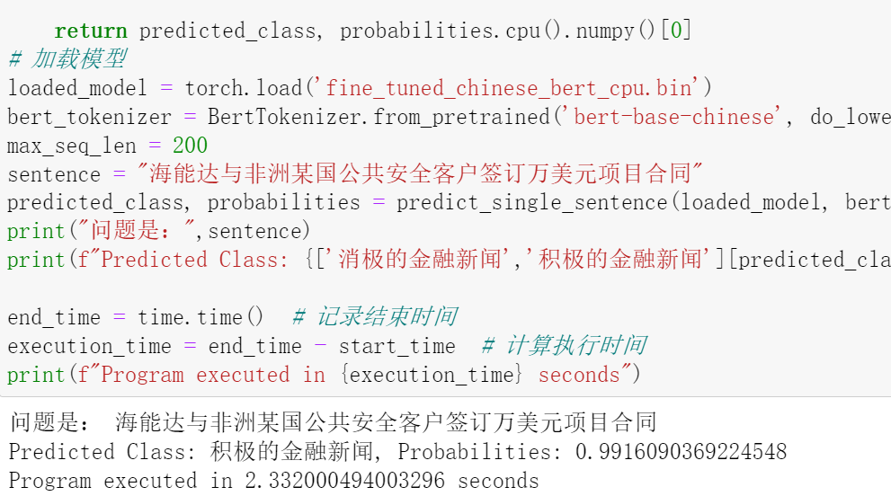
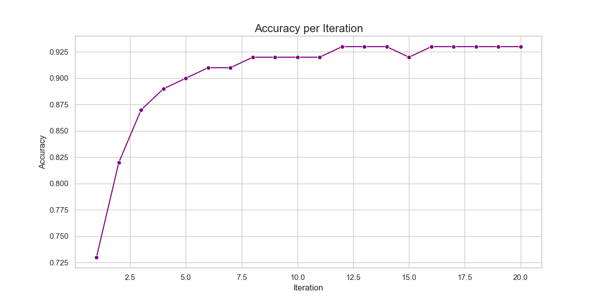
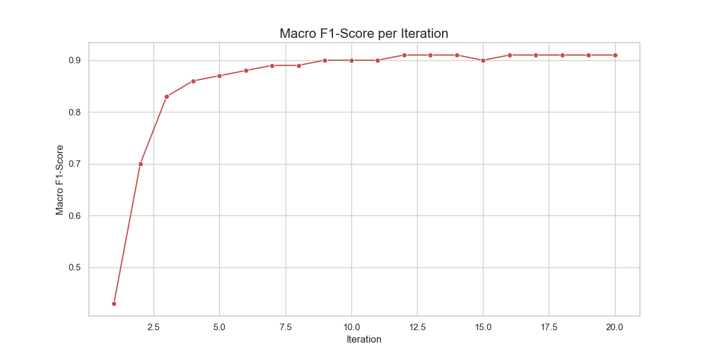
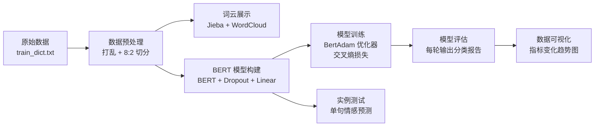

# 基于 BERT 的金融新闻标题情感分析

<p align="center">
  
  
  
  
</p>

> 使用中文预训练 BERT 模型对金融新闻标题进行**积极 / 消极**情感二分类，测试集准确率 **93%**，Macro-F1 **91%**。支持批量训练评估与单句实时预测。

新闻标题传递的情绪会直接影响投资者的判断与市场走向。相比基于词袋模型和情感词典的传统方法，BERT 通过预训练 + 微调能够更好地理解上下文语义，从而在金融文本情感分类上获得显著更高的准确率。本项目提供了从数据准备、模型训练、指标可视化到单句预测的完整流水线。

## 效果展示

单条新闻标题的实时预测：

<p align="center">
  
</p>

20 轮迭代中各评估指标的变化趋势（其余曲线见 [results/](results/)）：

<p align="center">
  
  
</p>

## 功能特性

- **数据预处理**：原始金融新闻数据（`{"title": ..., "label": ...}` 格式）一键转换为结构化训练/测试集，支持自定义切分比例
- **词云展示**：基于 Jieba 分词与 WordCloud 生成高频关键词词云，直观了解数据集特征
- **模型构建与训练**：BERT + Dropout + 全连接层的分类模型，支持冻结/全量微调两种模式，训练过程记录每轮 loss 与准确率
- **多维度评估**：每轮迭代输出 Accuracy、宏平均/加权平均的 Precision、Recall、F1 等指标
- **指标可视化**：自动解析评估日志，绘制 7 类指标随迭代次数的变化曲线
- **批量与单句预测**：数据管道支持批量情感分析，同时提供单条标题的实时预测接口，输出情感类别及概率分布

## 技术路线



## 数据集

- 共 **7,575 条**中文金融新闻标题（上市公司公告、并购、业绩预告等），按 **8:2** 随机切分为训练集（6,060 条）与测试集（1,515 条）
- 二分类标签：`1` = 积极（利好），`0` = 消极（利空）
- 类别分布存在不平衡：积极 72.5%，消极 27.5%

| 数据文件 | 说明 |
| --- | --- |
| `data/train_dict.txt` | 原始数据（每行一个 `{"title": ..., "label": ...}`） |
| `data/train_test_data.xlsx` | 切分后的训练/测试集（train / test 两个 sheet，列名 `comment`、`sentiment`） |

## 环境要求与安装

- Python ≥ 3.8
- GPU 训练推荐（CUDA 版 PyTorch），CPU 仅建议用于推理测试

```bash
git clone https://github.com/zhongyanghan/Sentiment-Analysis-of-Financial-News-Headlines-Based-on-BERT.git
cd Sentiment-Analysis-of-Financial-News-Headlines-Based-on-BERT
pip install -r requirements.txt
```

预训练模型 `bert-base-chinese` 会在首次运行时通过 Hugging Face 自动下载；网络受限时可提前手动下载并传入本地路径。

## 快速开始

**1. 数据准备**（从原始数据生成训练/测试集）

```bash
python src/prepare_data.py --input data/train_dict.txt --output data/train_test_data.xlsx
```

**2. 模型训练**（默认冻结 BERT 主体、仅微调分类头，与原实验配置一致）

```bash
python src/train.py --data data/train_test_data.xlsx \
    --bert bert-base-chinese \
    --epochs 5 --batch-size 512 --lr 4e-5 --max-seq-len 200
# 全量微调：追加 --no-lock
```

训练过程中每轮的评估报告会追加写入 `results/result.txt`，模型保存为 `fine_tuned_chinese_bert.bin`。

**3. 指标可视化**（解析评估日志并绘制曲线，可选生成词云）

```bash
python src/visualize.py --log results/result.txt --output-dir results
python src/visualize.py --wordcloud --font simkai.ttf   # 词云需自备中文字体文件
```

**4. 单句预测**

```bash
python src/predict.py --model fine_tuned_chinese_bert_cpu.bin \
    --text "海能达与非洲某国公共安全客户签订万美元项目合同"
```

输出示例：

```
标题：海能达与非洲某国公共安全客户签订万美元项目合同
预测结果：积极的金融新闻，置信度：0.9834
```

> 词云需要中文字体文件（如 `simkai.ttf`），请自行准备并放入项目根目录（已在 `.gitignore` 中忽略）。

## 训练结果

在测试集 1,515 条样本上的最终评估结果（第 20 轮迭代）：

| 类别 | Precision | Recall | F1-Score | Support |
| --- | --- | --- | --- | --- |
| 消极（0） | 0.89 | 0.85 | 0.87 | 409 |
| 积极（1） | 0.95 | 0.96 | 0.95 | 1,106 |
| **Accuracy / Weighted Avg** | | | **0.93** | 1,515 |
| Macro Avg | 0.92 | 0.91 | 0.91 | 1,515 |

主要训练配置：

| 参数 | 取值 |
| --- | --- |
| 预训练模型 | bert-base-chinese |
| 优化器 | BertAdam |
| 学习率 | 4e-5 |
| 批大小 | 512 |
| 最大序列长度 | 200 |
| 微调方式 | 冻结 BERT 主体，仅训练 pooler + 分类层 |

由于类别不平衡（积极样本约为消极的 2.6 倍），除 Accuracy 外请重点关注 **Macro-F1**：模型对多数类（积极）拟合更好，少数类（消极）的召回率仍有提升空间。

## 项目结构

```
.
├── README.md                     # 项目说明文档
├── LICENSE                       # MIT 许可证
├── requirements.txt              # 依赖列表
├── data/
│   ├── train_dict.txt            # 原始数据（7,575 条标题+标签）
│   └── train_test_data.xlsx      # 切分后的训练/测试集
├── src/
│   ├── prepare_data.py           # 数据转换与切分
│   ├── model.py                  # 模型定义与数据预处理
│   ├── train.py                  # 训练脚本
│   ├── visualize.py              # 指标曲线与词云可视化
│   └── predict.py                # 单句预测
├── results/                      # 评估日志与指标曲线图
├── docs/                         # 项目介绍、效果截图
└── notebooks/                    # 原始探索性 Jupyter Notebook
```

> `notebooks/bert_financial_news_sentiment.ipynb` 为项目初期的探索性实现，包含完整的数据转换、训练与可视化流程，可作为理解代码的参考；正式使用推荐 `src/` 下的模块化脚本。

## 改进方向

- **数据扩展与增强**：引入更多时间段、更多来源的新闻数据，并采用同义词替换、随机插入等增强手段提升泛化能力
- **模型升级**：尝试 RoBERTa-wwm、ERNIE、XLNet 等更强的中文预训练模型，并进行全量微调与超参数搜索
- **情感细分**：将二分类扩展为多级情感（如强烈利好 / 中性 / 强烈利空）
- **类别平衡**：引入加权损失（focal loss）或过采样策略，改善消极类召回率
- **情感原因分析**：结合生成式模型自动输出情感判断依据

## 许可证

本项目基于 [MIT License](LICENSE) 开源。

## 致谢

- [BERT: Pre-training of Deep Bidirectional Transformers for Language Understanding](https://arxiv.org/abs/1810.04805)
- [pytorch-pretrained-bert](https://github.com/huggingface/pytorch-pretrained-BERT)
- [bert-base-chinese](https://huggingface.co/bert-base-chinese)

---

如果这个项目对你有帮助，欢迎 **Star** ⭐ 支持！
